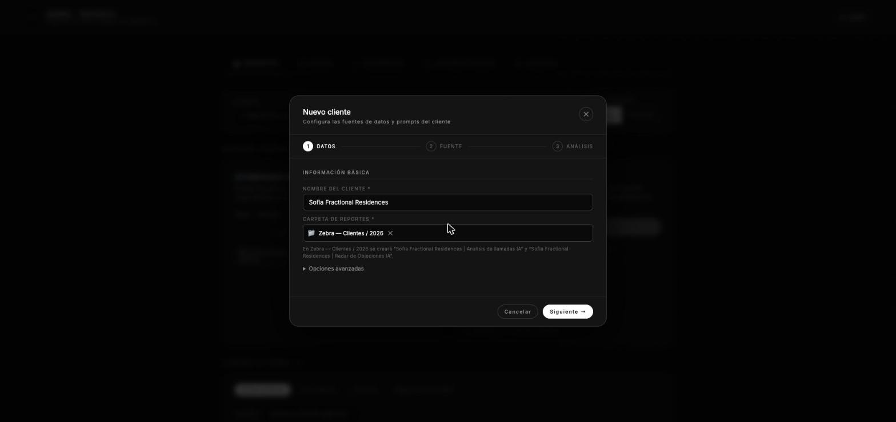
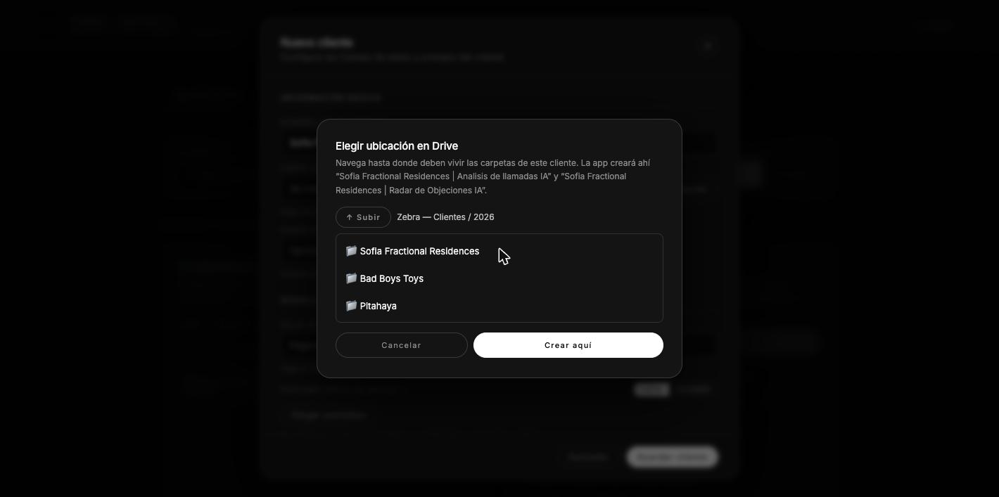
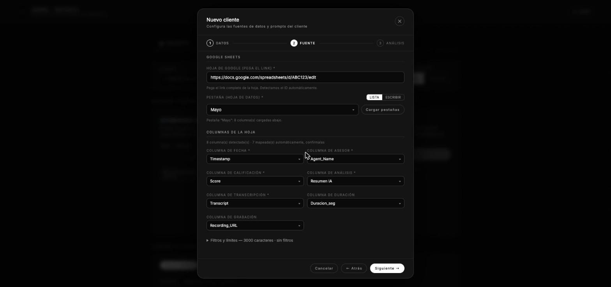
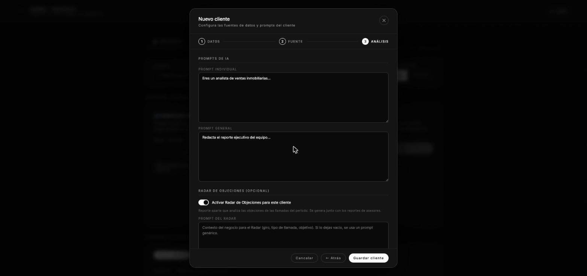
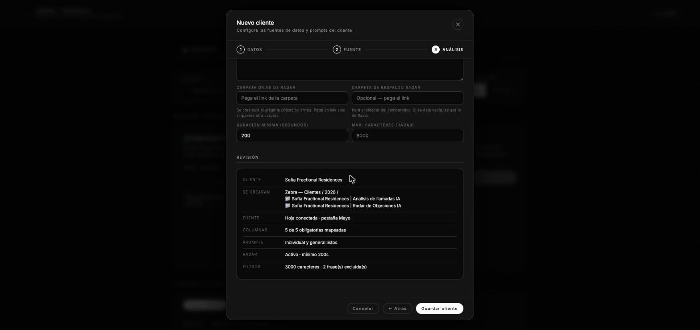

# Alta de un cliente — qué es cada campo

Guía del formulario **Ajustes → Clientes → Nuevo cliente**. Un cliente es la
configuración que le dice al sistema tres cosas: **de dónde saca las llamadas**
(una hoja de Google), **cómo debe analizarlas** (los prompts) y **dónde deja los
reportes** (carpetas de Drive).

El alta va en **tres pasos**, y cada uno valida antes de dejarte avanzar:

| Paso | Qué se define |
|---|---|
| **1 · Datos** | Nombre del cliente y dónde crear sus carpetas de Drive |
| **2 · Fuente** | Hoja de Google, pestaña y mapeo de columnas |
| **3 · Análisis** | Prompts, Radar de Objeciones y revisión final |

Los campos marcados con `*` son obligatorios. Si al pulsar "Siguiente" o
"Guardar cliente" falta alguno, la app salta al paso donde está y lo marca en
rojo.

---

## Paso 1 · Datos



### Nombre del cliente *
El nombre comercial, tal como debe aparecer en los reportes. Se usa en tres
lugares, así que conviene escribirlo bien desde el principio:

1. El título de los PDFs: `Sofia Fractional | Analisis de Llamadas | Mayo 2026`.
2. El nombre de las carpetas que la app crea en Drive (ver abajo).
3. El identificador interno del cliente (`sofia_fractional_a3f9c1`), que ya no
   cambia aunque después le cambies el nombre.

### Carpeta de reportes *
Dónde se guardan los PDFs que genera el sistema.

**No hace falta crear nada a mano.** Pulsa **📁 Elegir ubicación**, navega por tus
Unidades Compartidas hasta el lugar donde debe vivir este cliente, y pulsa
**Crear aquí**.



Al guardar, la app crea dos carpetas, lado a lado:

```
Ubicación que elegiste/
├── {Nombre del cliente} | Analisis de llamadas IA     ← los PDFs de reportes
└── {Nombre del cliente} | Radar de Objeciones IA      ← el PDF del Radar
```

Es idempotente: si esas carpetas ya existen con ese nombre exacto, las reutiliza
en vez de duplicarlas.

Si el cliente ya tiene su carpeta creada de antes, también puedes pegar el link
directamente en el campo de texto y la app detecta el ID sola.

> Las carpetas se crean con la cuenta de Google central (la del `oauth:setup`).
> Si en el selector no aparece ninguna unidad, esa cuenta no es miembro de la
> Unidad Compartida — es permiso, no un fallo de la app.

La ubicación elegida queda visible como chip (`📁 Zebra — Clientes / 2026 ✕`), y
debajo se lee exactamente qué carpetas se van a crear. La ✕ la quita si te
equivocaste.

### Carpeta de sidecars — en "Opciones avanzadas"
Opcional. Un *sidecar* es un archivo de texto (`Sidecar_{asesor}_{período}.txt`)
donde el sistema guarda el resumen de lo que analizó ese período. Es la memoria
que permite el comparativo "cómo viene este asesor contra el período anterior".

Si lo dejas vacío, la app crea sola una subcarpeta `_Sidecars` dentro de la
carpeta de reportes la primera vez que corre un reporte. Ese es el
comportamiento normal: casi nunca hay razón para llenar este campo.

---

## Paso 2 · Fuente



### Hoja de Google *
El link completo de la hoja donde el cliente vuelca sus llamadas. Pega la URL tal
cual (`https://docs.google.com/spreadsheets/d/.../edit#gid=0`), la app extrae el
ID sola.

La hoja debe pertenecer, o estar compartida, con la cuenta de Google central.

### Pestaña (hoja de datos) *
Qué pestaña dentro de ese archivo tiene las llamadas. Dos modos:

- **Lista** — pulsa "Cargar pestañas" y la app lee el archivo y te las ofrece en
  un menú. Es la vía recomendada: confirma de paso que hay acceso a la hoja.
- **Escribir** — teclear el nombre a mano, por si la hoja aún no existe.

---

### Columnas de la hoja

Aquí le dices al sistema qué columna de la hoja contiene cada dato.

Hasta que cargues una pestaña, los menús salen **bloqueados** con el aviso "Carga
una pestaña primero": no tiene sentido elegir columnas de una hoja que aún no se
ha leído.

Al cargarla, la app **auto-detecta las columnas por parecido de nombre**
(`Timestamp` → fecha, `Agent_Name` → asesor, `Transcript` → transcripción…) y te
dice cuántas mapeó. Solo rellena las que estén vacías, nunca pisa lo que ya
elegiste. **Confírmalas siempre**: acierta casi todo, pero es una heurística por
nombre, no magia.

| Campo | Qué debe contener |
|---|---|
| **Columna de fecha** * | La fecha de la llamada. Es lo que se usa para filtrar el período (mes o semana) del reporte. |
| **Columna de asesor** * | El nombre del asesor que atendió. Debe coincidir con el roster de asesores del cliente; es la clave con la que se agrupan las llamadas por persona. |
| **Columna de calificación** * | La nota o score que ya trae la llamada. Alimenta las métricas cuantitativas del reporte. |
| **Columna de análisis** * | El análisis o resumen que ya viene en la hoja (normalmente de otra herramienta). Se le pasa a Claude como contexto. |
| **Columna de transcripción** * | El texto completo de la llamada. Es la materia prima del análisis cualitativo. |
| **Columna de duración** | Opcional. Duración de la llamada en segundos. La necesita el Radar de Objeciones para descartar llamadas demasiado cortas. |
| **Columna de grabación** | Opcional. El link al audio. Solo se muestra en el reporte para poder ir a escuchar la llamada. |

---

### Filtros y límites — colapsado

El resumen de la cabecera ("3000 caracteres · sin filtros") te dice qué hay
configurado sin tener que abrirlo.

#### Frases excluidas
Lista separada por comas. Cualquier llamada cuya transcripción contenga alguna de
esas frases se ignora por completo.

Sirve para sacar ruido del análisis: buzones de voz, llamadas de prueba, mensajes
automáticos. Ejemplo: `buzón de voz, llamada de prueba, no contestó`.

#### Máx. caracteres de transcripción
Cuánto texto de cada transcripción se le manda a Claude. Por defecto **3000**.

Es un control de costo y de foco: llamadas muy largas se recortan. Subirlo da más
contexto pero encarece cada reporte; bajarlo abarata pero puede cortar la parte
interesante de la llamada.

---

## Paso 3 · Análisis



### Prompts de IA

Estos dos campos son el criterio de análisis del cliente. Aquí es donde metes su
metodología de venta, su producto y qué te importa medir. Dos clientes con la
misma hoja pero distintos prompts producen reportes completamente distintos.

#### Prompt individual
Cómo analizar a **cada asesor por separado**. Se ejecuta una vez por persona y
produce su PDF individual: fortalezas, errores, recomendaciones.

#### Prompt general
Cómo redactar el **reporte ejecutivo del equipo completo**. Se ejecuta una sola
vez, con los resultados de todos los asesores ya analizados.

---

### Radar de Objeciones (opcional)

Un segundo reporte, aparte del de asesores: analiza qué objeciones aparecen en
las llamadas y cómo se manejan. **Se corre sobre las transcripciones del período,
no en tiempo real durante la llamada.**

Está detrás de un interruptor: si el cliente no lo usa, déjalo apagado y sus
cinco campos ni siquiera aparecen. Apagado, tampoco se crea su carpeta en Drive.

| Campo | Qué hace |
|---|---|
| **Prompt del Radar** | Contexto del negocio para este análisis: giro, tipo de llamada, qué se está vendiendo. Si lo dejas vacío se usa un prompt genérico que funciona, pero rinde bastante menos. |
| **Carpeta Drive de Radar** | Dónde se guarda el PDF del Radar. Se crea sola al elegir la ubicación arriba (`{Cliente} \| Radar de Objeciones IA`); solo pega un link si la quieres en otro lado. |
| **Carpeta de respaldo Radar** | Dónde va el sidecar del Radar (`radar-YYYY-MM.json`), que habilita el comparativo mes contra mes. Vacío = se usa la misma carpeta del Radar. |
| **Duración mínima (segundos)** | Descarta llamadas más cortas que esto. Por defecto **200**. Una llamada de 30 segundos no tiene objeciones que analizar, solo mete ruido. Requiere tener configurada la columna de duración. |
| **Máx. caracteres (Radar)** | Igual que el límite de arriba, pero para el Radar. Por defecto **8000**, más alto porque las objeciones suelen aparecer al final de la llamada. |

---

### Revisión



Antes del botón de guardar, el resumen te dice en texto plano qué se va a crear:
nombre, carpetas con su nombre exacto, hoja y pestaña, cuántas columnas quedaron
mapeadas, si el Radar va activo y qué filtros aplican. Lo que falte sale marcado
en rojo.

---

## Qué pasa al pulsar "Guardar cliente"

1. Se validan los tres pasos; si algo falta, salta al paso donde está.
2. Si elegiste ubicación en Drive, se crean las dos carpetas del cliente.
3. Se guarda el cliente en Postgres (o en `clients.json` si no hay `DATABASE_URL`).
4. El cliente aparece ya disponible en el selector de la pantalla principal.

La carpeta `_Sidecars` no se crea aquí: aparece dentro de la carpeta de reportes
la primera vez que generas un reporte.

---

> Las capturas son de la app real. Los nombres de carpetas del selector
> (`Zebra — Clientes`, `2026`) son de ejemplo, puestos para ilustrar la
> navegación.
